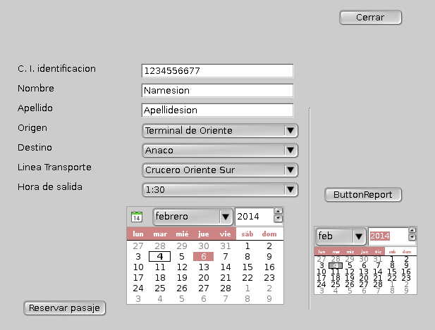

Moved to gitlab: https://gitlab.com/mckaygerhard/simplereservacion#tab-readme

simplereservacion
=================

Simple Reservacion de tickets de cualquier cosa (enfocado a viajes)

Introduccion
------------

El enfoque es de reservacion de un objeto de compra, 
para este caso reservar un objeto, este desde el lugar 
de donde se reserva respecto el lugar de la adquisicion 
del mismo, el objeto es el ticket, la linea el lugar de la adquisicion 
y el terminal el lugar de la reserva.

Esto es un carro de compras con accion retardada del objeto adquirido.

Authors
=======

PICCORO Lenz McKAY
Leonardo Salazar

Screenshot
----------

